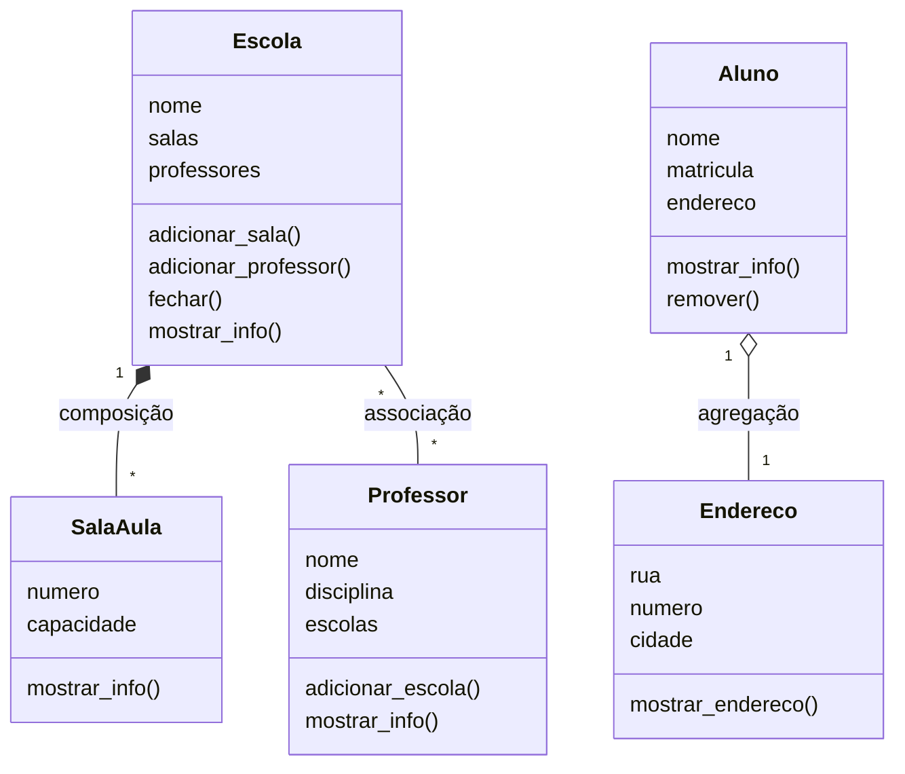

# Trabalho Prático 01 - Arquitetura de Software

Esse trabalho é um sistema simples de escola, feito em Python. A ideia foi praticar os tipos de relação entre classes: associação, agregação e composição.

## Como rodar

```bash
python main.py
```

## 1. Classes, atributos e métodos

| Classe    | Atributos                 | Métodos                                                   |
| --------- | ------------------------- | --------------------------------------------------------- |
| Escola    | nome, salas, professores  | adicionar_sala, adicionar_professor, fechar, mostrar_info |
| SalaAula  | numero, capacidade        | mostrar_info                                              |
| Professor | nome, disciplina, escolas | adicionar_escola, mostrar_info                            |
| Aluno     | nome, matricula, endereco | mostrar_info, remover                                     |
| Endereco  | rua, numero, cidade       | mostrar_endereco                                          |

## 2. Classificação das relações

### Escola e SalaAula: Composição

Uma sala de aula não faz sentido sem a escola. Se a escola fechar, as salas deixam de existir no sistema. No código, quem cria a sala é a própria `Escola`, por meio do método `adicionar_sala`. Quando o método `fechar` é chamado, as salas são apagadas. Por isso, essa relação foi classificada como composição.

### Professor e Escola: Associação

Um professor pode lecionar em várias escolas e uma escola pode ter vários professores. A existência de um não depende da existência do outro. No código, o professor é criado separadamente e depois associado à escola por meio do método `adicionar_professor`. Quando a escola fecha, o professor continua existindo normalmente. Por isso, essa relação foi classificada como associação.

### Aluno e Endereco: Agregação

O endereço é criado junto com o aluno, mas pode continuar existindo mesmo depois que o aluno for removido. O enunciado permite que o endereço continue fazendo sentido isoladamente, como em relatórios, e seja repassado para outro contexto. No código, o método `remover` retira a referência do endereço do aluno e devolve o objeto `Endereco`, permitindo que ele continue sendo utilizado. Por isso, essa relação foi classificada como agregação.

## 3. Diagrama de classes



### Legenda

`--` representa uma associação.

`*--` representa o losango preenchido, utilizado para composição.

`o--` representa o losango vazado, utilizado para agregação.
